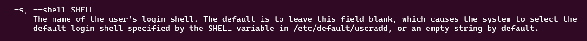

### Do follow for more such content
### Linkdin URL :- https://www.linkedin.com/in/uttkarsh-kesharwani-a321712b1/

<h2>Moving Ahead to the solution</h2>

Before moving to the solution first understand ,how we prevent access the user(system user) to prevent login. When we create a user, the linux gives the shell access to that user by default and the binary executable file present in "/bin/bash".
Simlarly, to prevent the login or shell or ssh access to the user , the binary executble file is present int "/sbin/nologin".

<h2>Moving to the command</h2>

man useradd :- This command gives you the manual , how to add the user ?

useradd [options] username :- this command helps you to add the user

 :- this image is screen shot of manual 

-s is option which accept argument(path to the qshell -> /sbin/nologin  in this case)

<h2>Final Answer</h2>

Before making the user we need to login to the another server(App server 3 ,in this case)
do :- ssh user@host-ip

Adding the user
do :- useradd -s /sbin/nologin yousuf

