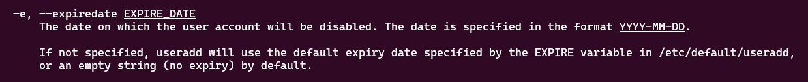

# Do follow for more such content
Linkdin URL :- https://www.linkedin.com/in/uttkarsh-kesharwani-a321712b1/

### Problem Statement:-
As part of the temporary assignment to the Nautilus project, a developer named kareem requires access for a limited duration. To ensure smooth access management, a temporary user account with an expiry date is needed. Here's what you need to do:
> Create a user named kareem on App Server 2 in Stratos Datacenter. Set the expiry date to 2026-12-07, ensuring the user is created in lowercase as per standard protocol.


# Solution 

1. Step-1 :- Login to the app server 2 (choose server according to your question)
  
  ```sh
    ssh username@host-ip
  ```
  >This step requires a password ,do enter carefully

2. Step-2 :- Add user `yousuf` with the expiry date to 2026-12-07 in (YYYY-MM-DD) format

  ```sh
    sudo useradd -e 2026-12-07 yousuf
  ```

> -e is option which take date(YYYY-MM-DD) , and set the expiry date for the user, after the specified date the user will be permanent blocked/removed


To know more ,open the manual for useradd :- 
```sh
   man useradd
```
3. Step-3 :- Verify the user 

  ```sh
    cat /etc/passwd
  ```

# Real world use case 
Suppose you hire intern for 3 months and after that i left the company , same goes with freelancer or contractor etc


# Good to know few command
- `chage` :- Used to manage and control user password expiration and aging policies (Modify user password expiry information)
- `passwd` :- Used to change or mangage the user password
- `usermod` :- Used to modify a user account

# Few commands which needs to know
- `chage -E DATE user1` :- This command lets you set the new expiry date(basically extend the expiry)
- `chage -l uttkarsh` :-  View aging info of the user password
