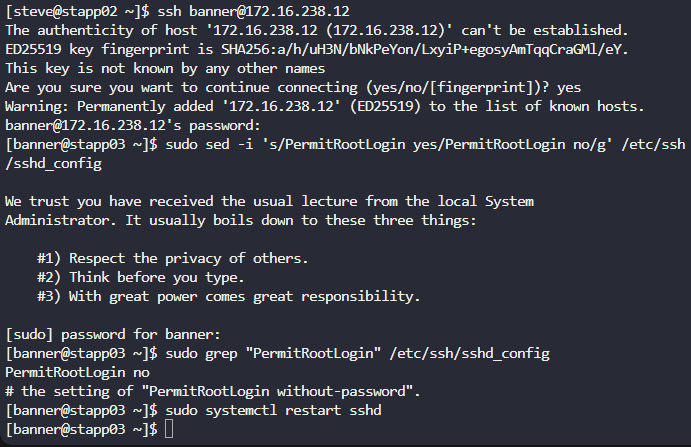
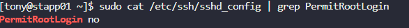

# Do follow for more such content
Linkdin URL :- https://www.linkedin.com/in/uttkarsh-kesharwani-a321712b1/

### Problem Statement :- 
Following security audits, the xFusionCorp Industries security team has rolled out new protocols, including the restriction of direct root SSH login.

> Your task is to disable direct SSH root login on all app servers within the Stratos Datacenter.

## Solution :-

1. Step-1 :- Login to each server via ssh (do it by yourself or google it)

    ```sh
      ssh user@host-ip
    ```
2. Step-2 :- Perform modification on file `/etc/ssh/sshd_config` 
      
      - change `PermitRootLogin yes` -> `#PermitRootLogin no`
      - then , restart the ssh process again , below are the command given

    ```sh
      sudo sed -i 's/PermitRootLogin yes/PermitRootLogin no/g' /etc/ssh/sshd_config
      sudo systemctl restart sshd
    ```

    or 

    ```sh
        sudo sed -i 's/PermitRootLogin yes/PermitRootLogin no/g' /etc/ssh/sshd_config && sudo systemctl restart sshd
    ```

## Example 
The below image is the visual apperance of the task for 1 user (you need to perform in the 3 server name :- stapp01,stapp02 and stapp03)


## Verify result

>sudo cat /etc/ssh/sshd_config | grep PermitRootLogin


### SSH configration option 

- `PermitRootLogin no`: Disable root login
- `PasswordAuthentication no`: Disable password auth
- `PubkeyAuthentication yes`: Enable key-based auth
- `Port 2222`: Change default port (since port 22 is open for ssh ,generally bot do attack on this port)

## Real world use case:-

1. `Stopping "Brute Force" Attacks`
Every server connected to the internet is constantly scanned by bots. Since every Linux system has a user named root, bots only have to guess one thing: the password.
`Without this change`: A bot has a 50% head start because it already knows the username is root.
`With this change`: A bot has to guess a unique username (like uttkarsh) and the password. This makes brute-forcing statistically much harder.

2. `Establishing an "Audit Trail" (Accountability)`
In a company with 10 engineers, if everyone logs in as root, you can't tell who made a mistake.
The Scenario: Someone accidentally deletes a database.
The Log: All the logs say is "root deleted the database." You have no idea which human did it.
The Solution: By forcing users to log in as themselves (e.g., ssh tony@server), the logs will show exactly who logged in. When they use sudo to perform admin tasks, their actions are tied to their specific identity.

3. `Preventing "Lateral Movement"`
If a hacker manages to compromise one small service on your server, they might try to "hop" into an SSH session.
If root login is allowed, and they find a cached password or a weak config, they get "keys to the kingdom" immediately.
If it's disabled, even if they get a password, the system will reject the login, forcing them to find a different, much harder way in.