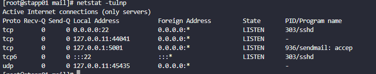
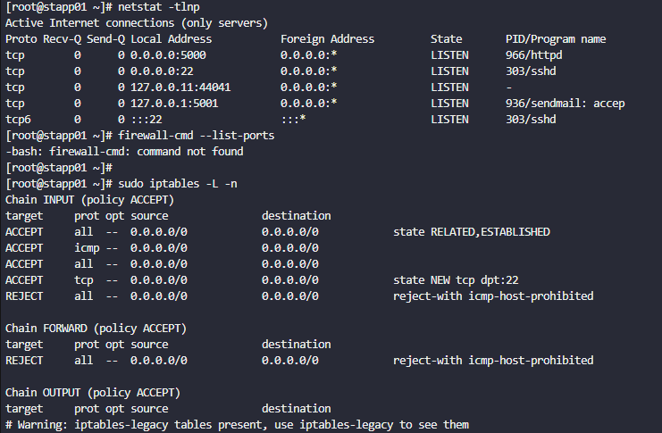

# Do follow for more such content
Linkdin URL :- https://www.linkedin.com/in/uttkarsh-kesharwani-a321712b1/


# Problem Statement :- 
Our monitoring tool has reported an issue in Stratos Datacenter. One of our app servers has an issue, as its Apache service is not reachable on port 5000 (which is the Apache port). The service itself could be down, the firewall could be at fault, or something else could be causing the issue.

- Use tools like `telnet`, `netstat`, etc. to find and fix the issue. Also make sure Apache is reachable from the jump host without compromising any security settings.

- Once fixed, you can test the same using command curl http://stapp01:5000 command from jump host.

- Note: Please do not try to alter the existing index.html code, as it will lead to task failure.


# Things to know upfront :-

- `telnet` :- telnet is a network testing tool used to check whether a remote port is reachable or not. It answers one simple question: “Can my system connect to that server on that port?”.
Telnet is not mainly used for login anymore (security reasons). Today it’s mostly used for connectivity testing. 

  eg :- ```  sh 
            telnet <hostname> <port>
            telnet stapp01 3002
        ```

- `netstat` :- netstat shows network status of your machine.It answers, “Which ports are open and which process is using them?”. But there are many other usecase of this command like ,
    - Checking Active Connections :- `netstat -an` 
    - Detecting Suspicious Connections (Security) :- `netstat -ant`
    - Viewing Routing Table :- `netstat -rn`

  eg :- ```sh
          netstat -tulpn
        ```

  Option	    Meaning
  -t	      TCP connections
  -u	      UDP connections
  -l	      Listening ports only
  -p	      Show process name
  -n	      Show numeric ports/IPs

  Example Output :- 
  > tcp   0   0   0.0.0.0:3002   0.0.0.0:*   LISTEN   1234/httpd


- `iptable` :- iptables is a firewall system in Linux. It controls which network packets are allowed which packets are blocked. Think of it as a security gate for your server.Before your service receives the request: iptables decides ,allow this connection or block it 


# Solution :- 


1. Login into app server.
2. Check `httpd/apache/nginx` service status

    ```shell
    tony@stapp01 ~]$ sudo systemctl status httpd
    ● httpd.service - The Apache HTTP Server
    Loaded: loaded (/usr/lib/systemd/system/httpd.service; disabled; vendor preset
    : disabled)
    Active: failed (Result: exit-code) since Wed 2025-08-06 01:38:21 UT
    C; 13min ago
        Docs: man:httpd.service(8)
    Process: 491 ExecStart=/usr/sbin/httpd $OPTIONS -DFOREGROUND (code=exit
    ed, status=1/FAILURE)
    Main PID: 491 (code=exited, status=1/FAILURE)
    Status: "Reading configuration..."

    Aug 06 01:38:21 stapp01.stratos.xfusioncorp.com httpd[491]: (98)Address already i
    n use: AH00072: make_sock: could not bind to address 0.0.0.0:5000
    Aug 06 01:38:21 stapp01.stratos.xfusioncorp.com httpd[491]: no listening sockets 
    available, shutting down
    top -
    ```

3. Lets check the network port status

    ```sh
    sudo netstat -tlnup
    ```

    ```txt
    Active Internet connections (only servers)
    Proto Recv-Q Send-Q Local Address           Foreign Address         State       PID/Program name    
    tcp        0      0 127.0.0.11:36025        0.0.0.0:*               LISTEN      -                   
    tcp        0      0 127.0.0.1:5000          0.0.0.0:*               LISTEN      430/sendmail: accep 
    tcp        0      0 0.0.0.0:22              0.0.0.0:*               LISTEN      298/sshd            
    tcp6       0      0 :::22                   :::*                    LISTEN      298/sshd            
    udp        0      0 127.0.0.11:56145        0.0.0.0:*                           -                   
    ```

    > You can see that the '5000' port is already being used by `sendmail`

4. So change the port for the sendmail , from 5000 to any other port (eg, `5001`)

5. Changing sendmail port

    ```sh
    cd /etc/mail
    vi sendmail.mc
    ```

    Find the  line and change port with some other value (i,e; `500`):

    ```sh
    DAEMON_OPTIONS(`Port=500,Addr=127.0.0.1, Name=MTA')dnl
    ```

    ```sh
    sudo systemctl restart sendmail
    ```

6. Now lets check port and service status

    ```sh
    sudo netstat -tlnup
    sudo systemctl status httpd sendmail
    ```
    


7. Test

    From app server:

    ```sh
    curl http://localhost:5000
    ```

    From jump host:

    ```sh
    curl http://stapp01:5000
    ```
    you will find the error, since the firewall block it 
    

8. Fixing firewall using `iptables`

    ```sh
    sudo iptables -L -n
    ```

    ```bash
    sudo iptables -L -n
    Chain INPUT (policy ACCEPT)
    target     prot opt source               destination         
    ACCEPT     all  --  0.0.0.0/0            0.0.0.0/0            state RELATED,ESTABLISHED
    ACCEPT     icmp --  0.0.0.0/0            0.0.0.0/0           
    ACCEPT     all  --  0.0.0.0/0            0.0.0.0/0           
    ACCEPT     tcp  --  0.0.0.0/0            0.0.0.0/0            state NEW tcp dpt:22
    REJECT     all  --  0.0.0.0/0            0.0.0.0/0            reject-with icmp-host-prohibited

    Chain FORWARD (policy ACCEPT)
    target     prot opt source               destination         
    REJECT     all  --  0.0.0.0/0            0.0.0.0/0            reject-with icmp-host-prohibited

    Chain OUTPUT (policy ACCEPT)
    target     prot opt source               destination         
    # Warning: iptables-legacy tables present, use iptables-legacy to see them
    ```

    That `FORWARD` rule is blocking the connection.

    Run the following command:

    ```sh
    sudo iptables -I INPUT 4 -p tcp --dport 500 -j ACCEPT
    ```

9. Finally it should work: `curl http://stapp01:5000`


